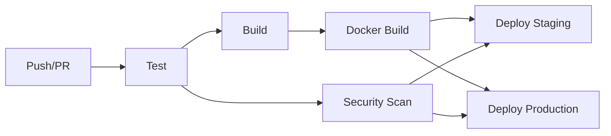

# Basic CI/CD Pipeline with GitHub Actions

A production-ready Node.js application demonstrating comprehensive CI/CD pipeline implementation using GitHub Actions.

## 🚀 Features

- **Automated Testing**: Unit tests with Jest and Supertest
- **Code Quality**: ESLint for code linting and standards
- **Security Scanning**: Trivy vulnerability scanner integration
- **Docker Support**: Multi-stage Docker builds with security best practices
- **Multi-Environment**: Staging and production deployment workflows
- **Artifact Management**: Build artifacts and test results storage

## 🏗️ Pipeline Architecture



## 📁 Project Structure

```
├── .github/workflows/
│   └── ci-cd.yml           # GitHub Actions workflow
├── src/
│   └── app.js              # Express.js application
├── tests/
│   └── app.test.js         # Jest test suite
├── Dockerfile              # Multi-stage Docker build
├── package.json            # Node.js dependencies and scripts
└── README.md              # This file
```

## 🔧 Local Development

### Prerequisites
- Node.js 18+
- Docker (optional)
- Git

### Setup
```bash
# Clone repository
git clone https://github.com/iammaksudul/basic-ci-cd-pipeline-with-github-actions.git
cd basic-ci-cd-pipeline-with-github-actions

# Install dependencies
npm install

# Run in development mode
npm run dev

# Run tests
npm test

# Run linting
npm run lint
```

### Docker Development
```bash
# Build Docker image
npm run docker:build

# Run container
npm run docker:run
```

## 🔄 CI/CD Pipeline

### Workflow Triggers
- **Push** to `main` or `develop` branches
- **Pull Requests** to `main` branch

### Pipeline Stages

#### 1. **Test Stage**
- Checkout code
- Setup Node.js environment
- Install dependencies
- Run ESLint for code quality
- Execute Jest test suite
- Perform security audit
- Upload test artifacts

#### 2. **Build Stage**
- Build application artifacts
- Upload build files for deployment

#### 3. **Docker Stage**
- Multi-stage Docker build
- Push to Docker registry
- Layer caching optimization

#### 4. **Security Stage**
- Trivy filesystem vulnerability scan
- SARIF report generation
- GitHub Security tab integration

#### 5. **Deployment Stages**
- **Staging**: Auto-deploy from `develop` branch
- **Production**: Auto-deploy from `main` branch
- Environment protection rules

## 🔐 Security Features

- **Container Security**: Non-root user, minimal base image
- **Dependency Scanning**: npm audit integration
- **Vulnerability Scanning**: Trivy security scanner
- **Secret Management**: GitHub Secrets for sensitive data
- **Health Checks**: Application health monitoring

## 📊 API Endpoints

### Health Check
```bash
GET /health
```
Response:
```json
{
  "status": "healthy",
  "timestamp": "2025-10-30T03:45:00.000Z",
  "uptime": 123.456
}
```

### Users API
```bash
# Get all users
GET /api/users

# Create user
POST /api/users
Content-Type: application/json

{
  "name": "John Doe",
  "email": "john@example.com"
}
```

## ⚙️ Configuration

### Required GitHub Secrets
```bash
DOCKER_USERNAME    # Docker Hub username
DOCKER_PASSWORD    # Docker Hub password or token
```

### Environment Variables
```bash
PORT=3000          # Application port (default: 3000)
NODE_ENV=production # Environment mode
```

## 🚀 Deployment

### Manual Deployment
```bash
# Build for production
npm run build

# Start production server
npm start
```

### Docker Deployment
```bash
# Pull latest image
docker pull username/basic-ci-cd-app:latest

# Run container
docker run -d \
  --name myapp \
  -p 3000:3000 \
  --restart unless-stopped \
  username/basic-ci-cd-app:latest
```

### Kubernetes Deployment
```yaml
apiVersion: apps/v1
kind: Deployment
metadata:
  name: basic-ci-cd-app
spec:
  replicas: 3
  selector:
    matchLabels:
      app: basic-ci-cd-app
  template:
    metadata:
      labels:
        app: basic-ci-cd-app
    spec:
      containers:
      - name: app
        image: username/basic-ci-cd-app:latest
        ports:
        - containerPort: 3000
        livenessProbe:
          httpGet:
            path: /health
            port: 3000
          initialDelaySeconds: 30
          periodSeconds: 10
```

## 📈 Monitoring

- **Health Checks**: `/health` endpoint
- **Application Metrics**: Process uptime and status
- **Container Health**: Docker HEALTHCHECK directive
- **Pipeline Metrics**: GitHub Actions workflow insights

## 🤝 Contributing

1. Fork the repository
2. Create feature branch (`git checkout -b feature/amazing-feature`)
3. Commit changes (`git commit -m 'Add amazing feature'`)
4. Push to branch (`git push origin feature/amazing-feature`)
5. Open Pull Request

## 📝 License

MIT License - see [LICENSE](LICENSE) file for details.

## 👨‍💻 Author

**Alam** - DevOps Engineer
- GitHub: [@iammaksudul](https://github.com/iammaksudul)
- Email: kh.maksudul.alam.cse@gmail.com

---

*This project demonstrates enterprise-grade CI/CD practices and is production-ready.*
